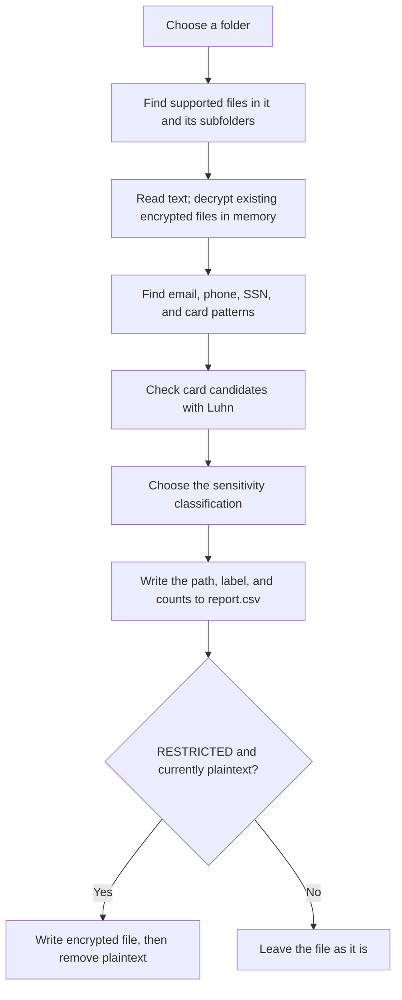

# Data Discovery Classifier

This application helps you answer three questions about files in a folder:

1. Which files contain information that looks sensitive?
2. How should each file be classified?
3. Which files should the application encrypt under its current rules?

You choose a folder, run a Python script, and open the resulting `report.csv`
in a spreadsheet or text editor. The report lists each supported file, its
sensitivity category, and how many email addresses, phone numbers, Social
Security numbers (SSNs), and credit card candidates were found.

**This is a local-file prototype.** It runs on a computer and scans a folder that
computer can read. It does not connect directly to mailboxes, SaaS applications,
or cloud storage accounts. It demonstrates part of a data-protection workflow;
it does not provide organization-wide monitoring or enforcement.

**Current behavior:** only newly scanned plaintext files classified as
`RESTRICTED` are automatically encrypted. `CONFIDENTIAL` files remain plaintext.
The docstring and encryption comment in `scanner.py` still say `CONFIDENTIAL`,
but the executable condition checks `RESTRICTED`. This README describes the
executable logic.

## The five concepts, in plain language

| Concept | What it means | What this application does |
| --- | --- | --- |
| Data discovery | Find where potentially sensitive information is stored. | Opens supported files in your chosen folder and its subfolders, then searches their text for four kinds of values. |
| Data classification | Decide how sensitive a file is based on what was found. | Assigns `INTERNAL`, `CONFIDENTIAL`, or `RESTRICTED` using explicit rules. |
| Data labeling | Record the classification so someone or another system can use it. | Writes the label in the `Classification` column of `report.csv`. It does not embed a label in the original file. |
| Encryption | Transform readable contents into data that requires a secret key to restore. | Encrypts `RESTRICTED` plaintext files with Fernet and gives them an `.encrypted` suffix. |
| Secure handling | Control how sensitive information is read, reported, stored, and restored. | Reports counts instead of matched values, uses a key for encryption, and reads existing encrypted files in memory during scans. Other protections remain limited. |

Classification is a decision; labeling records that decision; encryption is a
separate action. A `CONFIDENTIAL` label in the report does **not** mean the file
is encrypted. Similarly, `INTERNAL` means none of the configured rules matched,
not that the file is guaranteed to contain no sensitive information.

## What happens when you scan?



For example, imagine a folder containing these made-up samples:

| File | Contents | Discovery result | Report label | File after scanning |
| --- | --- | --- | --- | --- |
| `notes.txt` | `Team meeting tomorrow.` | No configured pattern matches | `INTERNAL` | `notes.txt` |
| `contacts.txt` | `Email: john@example.com` | One email match | `CONFIDENTIAL` | `contacts.txt` |
| `identity.txt` | `SSN: 123-45-6789` | One SSN match | `RESTRICTED` | `identity.txt.encrypted` |

The report contains the counts and original filenames, not the example values.
On a second scan, `identity.txt.encrypted` is read using the existing key and
still gets a report row for `identity.txt`. It stays encrypted on disk.

## Endpoints, email, SaaS, and cloud: what is supported?

An **endpoint** is a computer such as a laptop, desktop, or server. **SaaS** means
software accessed as an online service. **Cloud platforms** can host storage,
applications, and servers. The current application works with filesystem paths;
it has no service login, API connection, or remote policy controls.

| Environment | What works today | What is not implemented |
| --- | --- | --- |
| Endpoints | Manually scan a readable folder on the computer running Python. | Automatic deployment to other devices, background monitoring, centralized policies, or blocking file transfers. |
| Email | Scan supported text files manually saved or exported from email. An email-address match detects text, not a mailbox. | Mailbox access, message retrieval, `.eml`/`.msg` parsing, attachment extraction, or blocking outgoing mail. |
| SaaS | Scan a locally downloaded export if it uses a supported text format. | Service authentication, direct content discovery, service-native labels, sharing restrictions, or changes to the source record. |
| Cloud platforms | Scan downloaded supported files, or readable filesystem paths exposed to the machine. | Cloud storage API integration, cloud account inventory, remote object labeling, or cloud key-management integration. |

For example, scanning a downloaded CSV export from an online service classifies
the **local copy**. It does not label, encrypt, delete, or restrict the original
record in that service. This script contains no upload or synchronization logic.
If an external sync client manages the scanned folder, that client may propagate
the script's file changes; use a separate local copy when experimenting.

Supporting these platforms directly would require additional code: a connector
to retrieve content with appropriate permissions, a way to extract readable text,
and platform-specific operations to apply labels or protection. Those are future
extension points, not existing application features.

## Project layout

| Path | Purpose |
| --- | --- |
| `scanner.py` | Patterns, classification, scanning, encryption, and decryption |
| `test_data/` | Sample inputs for trying the scanner |
| `report.csv` | Generated scan results; replaced on every scan |
| `secret.key` | Generated Fernet key, stored beside `scanner.py` |
| `*.encrypted` | Encrypted files, stored beside their original locations |
| `.gitignore` | Excludes keys, encrypted files, Python caches, and IDE settings |

## Setup

The **project root** is the folder containing `scanner.py` and this README.
Open a terminal in that folder before running the commands below. A **virtual
environment** is a private location for this project's Python packages.

Use Python 3 with `str.removesuffix` support (Python 3.9 or newer) and the
third-party `cryptography` package. The project has been exercised with Python
3.14.5. There is currently no dependency manifest or pinned package version.

From the project root, create a virtual environment and install the dependency.
These PowerShell commands use the environment's interpreter directly, so
activation is not required:

```powershell
py -m venv .venv
.\.venv\Scripts\python.exe -m pip install cryptography
```

On macOS or Linux:

```bash
python3 -m venv .venv
.venv/bin/python -m pip install cryptography
```

Use that same interpreter to run the application. The commands below use Windows
PowerShell; on macOS/Linux, substitute `.venv/bin/python`.

## Scan a directory

Work on sample data or copies: scanning can replace plaintext files with encrypted
versions. From the project root, run:

```powershell
.\.venv\Scripts\python.exe scanner.py test_data
```

You can supply another directory, including an absolute path. Quote paths that
contain spaces:

```powershell
.\.venv\Scripts\python.exe scanner.py "C:\Data\Sample Files"
```

Relative input paths and `report.csv` are resolved from the **working directory**.
The key is always resolved from the directory containing `scanner.py`.

The scanner prints `File encrypted:` for each newly encrypted file and
`Report written to report.csv` when the scan completes. Encryption writes
`<original path>.encrypted`, then removes the plaintext file.

Scan a dedicated input directory such as `test_data`, rather than the project
root: the scanner does not explicitly exclude its own CSV report.

## How the code discovers and classifies data

The scanner walks the input directory and its subdirectories with `os.walk`.
It reads `.txt`, `.csv`, `.json`, `.xml`, and `.log` files as UTF-8 text. Structured
formats are scanned as raw text; their fields are not parsed.

Detection uses **regular expressions**: patterns describing what a value looks
like. For example, the phone rule expects three digits, a hyphen, three digits,
another hyphen, and four digits. PDFs, Word documents, images, archives, and
other unsupported formats are skipped; the scanner does not extract their text.

The **Luhn checksum** is an arithmetic check on the digits of a card candidate.
It filters out some unlikely card numbers but does not verify a card account,
its owner, or whether it is active.

| Data type | Detection rule |
| --- | --- |
| Email | `\S+@\S+\.\S+` |
| SSN | `\d{3}-\d{2}-\d{4}` |
| Credit card | `\d{16}`, followed by a Luhn checksum check |
| Phone number | `\d{3}-\d{3}-\d{4}` |

Every match contributes to its count, including repeated occurrences. Credit
card counts include only candidates that pass Luhn. These are simple heuristics:
they can match substrings, miss other formats, and do not establish that a value
is real or valid beyond the checks above.

Classification uses the following precedence:

| Classification | Condition | Action on plaintext |
| --- | --- | --- |
| `RESTRICTED` | At least one SSN or Luhn-valid card candidate | Encrypt the file |
| `CONFIDENTIAL` | No restricted match, but at least one email or phone number | Leave plaintext |
| `INTERNAL` | None of the above | Leave plaintext |

For example, a file containing an email and an SSN is `RESTRICTED`, even though
both types are counted. A file containing only an email and a phone number is
`CONFIDENTIAL`.

## Report contents and repeat scans

This report is the application's **labeling mechanism**. It associates a file
path with a classification, but does not add document metadata, a visible
watermark, a file permission, or a label understood by another platform. The
`.encrypted` suffix describes the stored format; it is not a sensitivity label.

The CSV contains paths, classifications, and counts, not the matched values:

```csv
Path,Classification,Email Count,SSN Count,Credit Card Count,Phone Number Count
test_data\file2.txt,CONFIDENTIAL,1,0,0,1
```

Each scan rebuilds the report from files currently present in the scanned
directory. It does not append results or retain historical rows for deleted files.

Files ending in `.encrypted` are included when their original extension is
supported, for example `file2.txt.encrypted`. The scanner decrypts their contents
**in memory**, recalculates their classification and counts, and writes a row using
the original path (`file2.txt`). It neither restores plaintext to disk nor encrypts
the ciphertext again. This keeps their rows present on repeat scans and can
rebuild the report even if an earlier report was deleted.

If both plaintext and encrypted versions are present in the same directory at
the start of its scan, the plaintext version takes precedence and is reported
once. If that plaintext is `RESTRICTED`, encryption overwrites the existing
encrypted counterpart. Existing encrypted files stay encrypted regardless of
their recalculated classification.

## Decrypt a file

**Plaintext** is the original readable content. **Ciphertext** is its encrypted
form. Fernet uses the same secret key to encrypt and decrypt; the key is stored
as `secret.key` beside the script. Changing the filename back from `.encrypted`
to `.txt` does not decrypt its contents.

Pass the encrypted filename, including its `.encrypted` suffix:

```powershell
.\.venv\Scripts\python.exe scanner.py --decrypt test_data/file2.txt.encrypted
```

Use this example only when that encrypted file exists. Under the current policy,
scanning the email/phone-only `file2.txt` sample does not create it automatically.
The same command works with the path of any file encrypted by the scanner.

Decryption reads the existing `secret.key`, restores the original bytes to the
filename without `.encrypted`, and then removes the encrypted file. It prints
`File decrypted:` on success. Decrypt mode exits without scanning or updating
`report.csv`.

The current implementation overwrites an existing destination without prompting.
Always supply the `.encrypted` suffix: there is no suffix validation, and using
an encrypted input without that suffix can cause the restored file to be deleted.

## Run in PyCharm

In **Run → Edit Configurations → + → Python**, create two configurations so you
can switch operations without editing the parameters each time. Use these shared
settings, replacing `<project-root>` with your local checkout directory:

| Setting | Value |
| --- | --- |
| Script path | `<project-root>/scanner.py` |
| Python interpreter | The interpreter where `cryptography` is installed |
| Working directory | `<project-root>` (the folder containing `scanner.py` and `test_data/`) |

### Configuration 1: Scan and encrypt

Set **Name** to `Scan and encrypt` and **Script parameters** to exactly:

```text
test_data
```

This scans the directory, updates `report.csv`, and encrypts any `RESTRICTED`
plaintext files. For example, a supported `file3.txt` containing an SSN becomes
`file3.txt.encrypted`. Email/phone-only files are `CONFIDENTIAL` and stay plaintext
under the current code. There is no `--encrypt` option or direct single-file
encryption mode: supply the directory containing the files to scan.

### Configuration 2: Decrypt a file

Set **Name** to `Decrypt file` and **Script parameters** to the encrypted file's
path preceded by `--decrypt`, for example:

```text
--decrypt test_data/file3.txt.encrypted
```

To decrypt an existing encrypted `file2` instead, specify:

```text
--decrypt test_data/file2.txt.encrypted
```

The selected encrypted file must exist, and `secret.key` beside `scanner.py` must
be the key used to encrypt it. Decryption restores the original filename and
contents, removes the `.encrypted` file, and leaves `report.csv` unchanged.

Enter only the arguments shown above in **Script parameters**; do not include
`python` or `scanner.py` there. For paths with spaces, quote the path, for example
`--decrypt "test_data/customer records.txt.encrypted"`.

Click **OK**, select the desired configuration in the run selector, then click
**Run**. Saving the configuration alone does not execute it. Check the Run console
for `File encrypted:` or `File decrypted:`, any errors, and the exit code. Refresh
the project view if it does not reflect changes made on disk.

## Troubleshooting

| Symptom | What to check |
| --- | --- |
| `ModuleNotFoundError: cryptography` | Install the package into the interpreter selected for the run. |
| Only a usage message appears | Supply a directory or `--decrypt` followed by a filename. |
| A file is not encrypted | Only `RESTRICTED` plaintext files are encrypted by the current condition; other extensions are skipped. |
| An encrypted file remains after scanning | Expected: scan mode reads it in memory. Use `--decrypt` to restore it. |
| Report appears unchanged | Check the actual working directory and Run console. The output is `report.csv`; decrypt mode does not update it. |
| Report contains only its header | Check that the input directory exists and contains supported files. A nonexistent directory is not explicitly rejected. |
| Key missing or `InvalidToken` | Restore the original matching key; a different key or damaged ciphertext cannot decrypt the file. |
| `FileNotFoundError` during decryption | Check the working directory and the full input filename, including `.encrypted`. |
| Permission or UTF-8 decoding error | Ensure the files are accessible and supported text inputs use UTF-8. |

## How sensitive data is handled, and what remains unprotected

The current protections are specific to this local workflow:

| Stage | Implemented behavior | Limit to understand |
| --- | --- | --- |
| Reading | Processes file contents locally and decrypts encrypted inputs in memory for scanning. | Readable data exists in process memory; there is no memory-clearing mechanism. |
| Reporting and labeling | Stores paths, classifications, and counts instead of the matched sensitive values. | Paths and counts can still reveal information. The report itself has no special access protection. |
| Encryption | Uses Fernet for `RESTRICTED` plaintext files. | `CONFIDENTIAL` files remain readable; a person with both the key and ciphertext can decrypt them. |
| Key storage | Keeps `secret.key` beside the script and excludes it from Git through `.gitignore`. | Git exclusion does not restrict who can read the local key file. |
| Restoration | Requires the matching key to restore original bytes. | Decryption writes plaintext back to disk and can overwrite an existing destination. |

This prototype does not implement user authentication, role-based authorization,
auditable access history, retention rules, or controls over emailing, copying,
uploading, or sharing data. It does not establish regulatory compliance or enforce
security policies across endpoints and online services.

Additional implementation limits:

- Keep the original key private and backed up separately from the encrypted
  data. `secret.key` and `*.encrypted` are ignored by Git, but filesystem access
  restrictions, key rotation, and a secrets manager are not implemented.
- Encryption creates a key if none exists. Decryption and encrypted-file
  scanning require the existing matching key; creating a new key cannot recover
  older ciphertext.
- File deletion uses `os.remove`; this is ordinary deletion, not secure erasure.
  Reports and decrypted files do not receive special access permissions.
- Every file is read fully into memory. Decrypted content exists in process
  memory during a scan, so this is not a streaming scanner for very large files.
- Most errors stop the run. Reports are opened in write mode before scanning,
  so failures can leave a partial report. Report and encrypted-file writes are
  not atomic, and existing output files can be overwritten.
- Classification labels are recorded in the CSV; the application does not apply
  operating-system labels or access-control policies. `CONFIDENTIAL` data is
  currently left unencrypted.

## Developer entry points

- Edit the pattern constants and `TEXT_EXTENSIONS` to change detection scope.
- `is_valid_card()` implements the Luhn check.
- `get_key()`, `encrypt_file()`, and `decrypt_file()` manage encryption operations.
- The bottom-level script handles arguments, directory traversal, classification,
  and CSV output. It has no `if __name__ == "__main__"` guard, so importing
  `scanner.py` also executes its command-line logic.

For a manual regression check, use a disposable directory with an email/phone
sample, a sample SSN (`123-45-6789`), and ordinary text. Scan twice: verify the
SSN file becomes encrypted on the first scan, its row and counts remain on the
second, and the email/phone file remains plaintext. Decrypt the SSN file and
verify its original contents return and its encrypted counterpart is removed.
